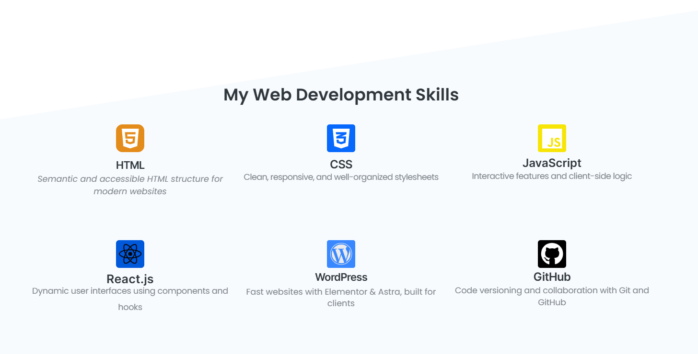
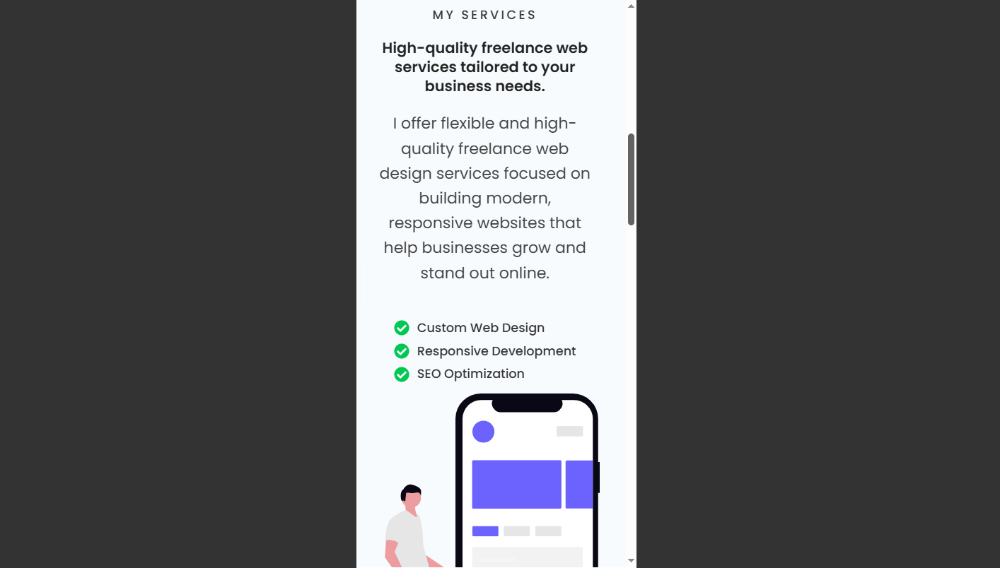
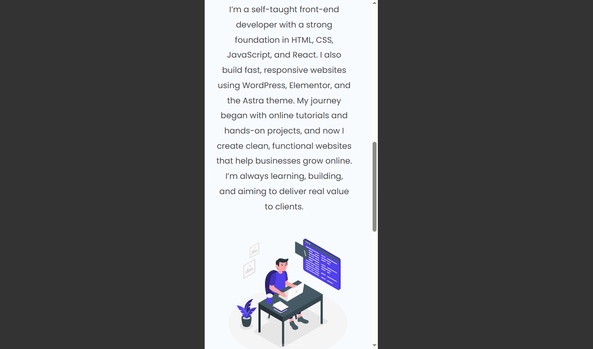

# 🌐 Freelance Services Website (WordPress)

This is a fully customized **freelance portfolio website** built with **WordPress**, created to showcase my web design and development services.  
The site was built independently using **Elementor**, the **Astra Theme**, and developed locally with **LocalWP**.

---

## 🛠️ Tools & Technologies

- WordPress (via LocalWP)
- Elementor Page Builder
- Astra Theme
- Custom illustrations from [undraw.co](https://undraw.co)
- Responsive design (desktop, tablet, mobile)

---

## 📄 Project Description

This is my first real-world freelance website built from scratch without following a step-by-step tutorial. 
I began by studying and practicing with a Tech Startup Elementor template, then **rebuilt it into my own branded freelance services site** — structured clearly, styled consistently, and designed with real client work in mind.

### 🧩 The Website Includes:
- 🏠 **Home Page** – Hero intro, service highlights, and smooth anchor links
- 👤 **About Page** – My background, skills, and mission
- 💼 **Services Page** – Clear list of the services I offer
- ✉️ **Contact Page** – Simple contact form and navigation anchors

---

## 📸 Screenshots

> All images are inside the `/screenshots` folder

| Page / View        | Preview |
|--------------------|---------|
| Home Page (1)      |  |
| Home Page (2)      |  |
| Home Page (3)      |  |
| Mobile View (1)    |  |
| Mobile View (2)    |  |
| Mobile View (3)    |  |

---

## 🎥 Demo Video

🎬 [Watch Full Walkthrough Video](https://bit.ly/wordpress-demo-video)

This video shows the full website in action, including mobile responsiveness and smooth navigation between all pages.

---

## 🚀 Development Journey

Through this process, I learned:
- How to build a real WordPress site without hosting
- How to design responsive, modern layouts
- How to showcase services in a way that’s ready for freelance clients

---

## 🧠 What I Learned

- Designing responsive websites from scratch
- Using Elementor efficiently without relying on templates
- Turning a basic layout into a personal, client-ready project
- Presenting my work with screenshots, videos, and GitHub

---

## 📝 Future Plans

This is **version 1.0** of the website. I'm continuously improving it and plan to release future versions (v1.1, v1.2, etc.) with enhancements.

Planned updates include:
- Hosting the site live with a custom domain
- Adding a blog section
- Improving animations and contact form UX
- Enhancing accessibility and performance
- Offering this layout as a reusable template for client work

---

## 🙋‍♂️ About Me

I'm a self-taught front-end developer and freelancer passionate about WordPress and web design.  
This project is part of my journey to **earn income through real freelance work**, build a strong portfolio, and grow as a web professional.

👉 [View my GitHub profile](https://github.com/luaiadhmani)
