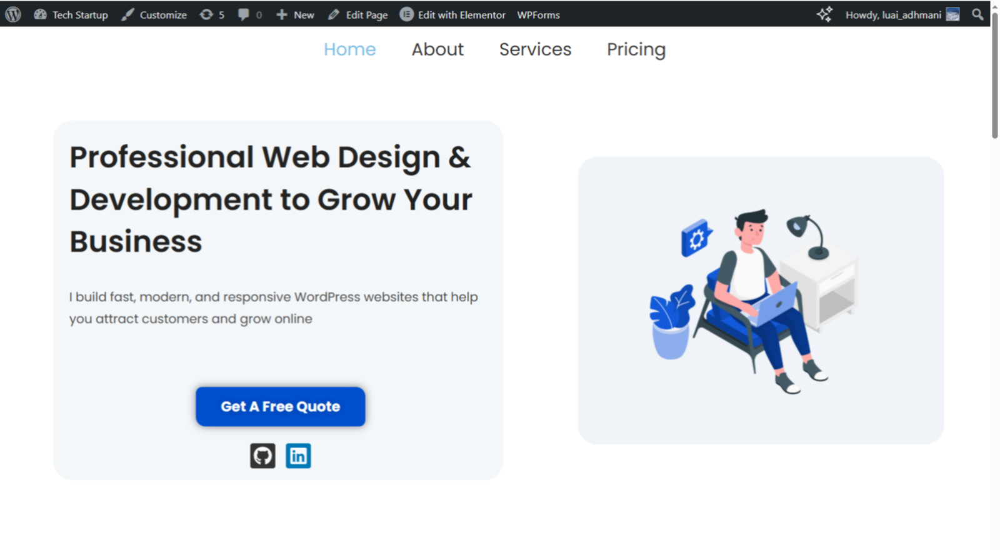
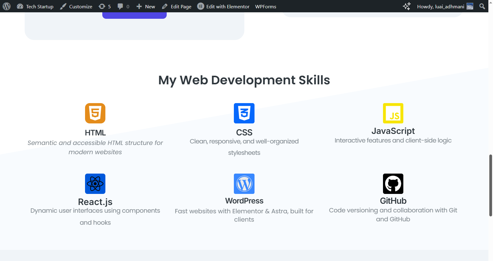
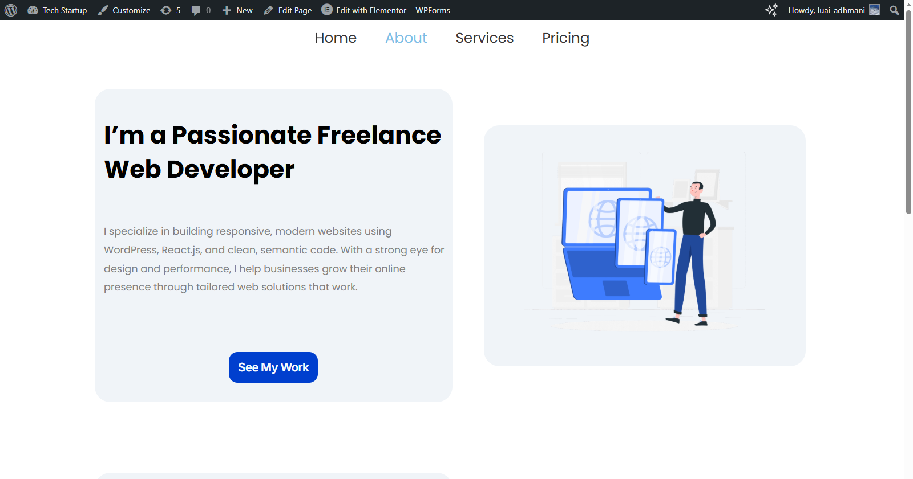
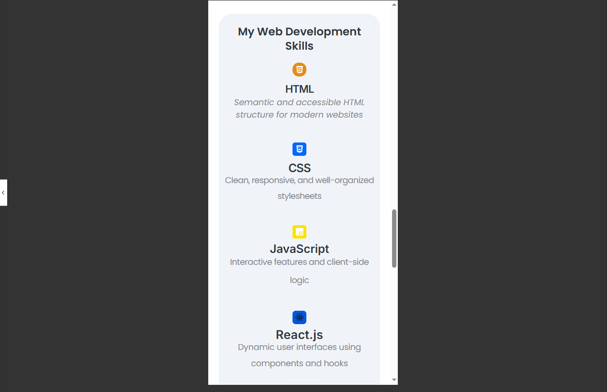

# 🌐 Freelance Services Website (WordPress)

This is my **first custom WordPress website**, built independently as a real-world freelance portfolio to showcase my web design and development services.

I created it using **Elementor**, the **Astra Theme**, and developed it locally with **LocalWP** — no full tutorial, just research, trial and error, and practical learning.  
This project marks the beginning of my freelance journey, with a focus on delivering quality work and constantly improving.

---

## 🛠️ Tools & Technologies

- WordPress (LocalWP)
- Elementor Page Builder
- Astra Theme
- Custom illustrations from [storyset.com](https://storyset.com)
- Responsive design for desktop and mobile

---

## 📄 Project Overview

I started by experimenting with a Tech Startup template, then completely rebuilt and customized it into **my own branded freelance website**.  
This site is structured clearly, styled professionally, and designed with real client projects in mind.

### 🔍 Key Pages:
- 🏠 **Home Page** – Hero intro, anchor links, and service highlights
- 👤 **About Page** – My story, skills, and values
- 💼 **Services Page** – A clean list of my offerings
- ✉️ **Contact Page** – Functional form and easy navigation

---

## 📸 Screenshots

> Located in `/screenshots/` folder

| Page / View        | Preview |
|--------------------|---------|
| Home Page (1)      |  |
| Home Page (2)      |  |
| Home Page (3)      |  |
| Mobile View (1)    |  |
| Mobile View (2)    |  |

---

## 💡 Learning Highlights

- Building full websites without hosting
- Designing responsive layouts from scratch
- Using Elementor with intention (not just dragging and dropping)
- Turning a practice layout into a real freelance asset
- Presenting work clearly with screenshots and video

---

## 🔄 Ongoing Improvements

This is **version 1.0** — I will keep updating it as I grow.

Planned updates:
- Live deployment with a custom domain
- Adding a blog section
- UX improvements (animations, contact form)
- Performance and accessibility tweaks
- Packaging it as a client-ready reusable template

---

## 🙋 About Me

I'm Luai Adhmani, a self-taught frontend developer focused on **React** and **WordPress**.  
I love learning by doing, solving real problems, and building clean, responsive websites.  
My goal is to **earn through freelance work and remote jobs**, work with real clients, and grow every day.

📫 [Check out my GitHub](https://github.com/luaiadhmani)

---

> 💬 If you're a client, freelancer, or hiring remotely — I’d love to connect!
